# DC Motor Manufacturing Quality Control — SPC Analysis

Statistical Process Control (SPC) analysis of a DC motor manufacturing process, focusing on **winding resistance (WR)** as the key quality characteristic. The study detects process instability, identifies root causes using the 6M Fishbone framework, applies corrective actions, and validates the improved process through capability analysis.

> **Course:** Quality Control  
> **Institution:** Helwan National University — Robotics & Mechatronics Department  
> **Supervisor:** Prof. Nariman &nbsp;|&nbsp; **TA:** Asmaa AL-Robi  
> **Team:** Yousef Ahmed Elbeltagy · Mohamad Sherif Shabrawy · Mohamed Ali Ismail · Verina Elkess · Yousef Wail Ismail · Amr Sherif Maher

---

## Dataset

30 production batches of **DCM-750 DC motors**, with 5 motors inspected per batch. For each batch: 5 winding resistance (WR) measurements in ohms + number of defective units.

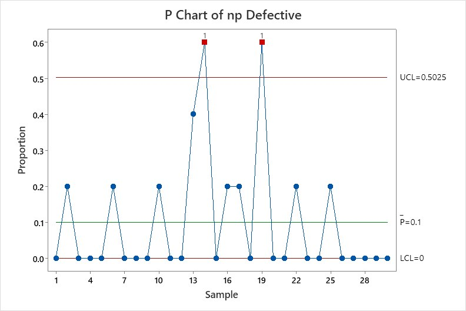

| Parameter | Value |
|---|---|
| Quality Characteristic | Winding Resistance (Ω) |
| Specification Limits | LSL = 4.20 Ω · USL = 4.80 Ω |
| Production Batches | 30 |
| Subgroup Size (n) | 5 motors per batch |
| Total Units Inspected | 150 |

---

## Methodology

The analysis follows a structured SPC workflow — from raw data through root cause analysis to final process validation.

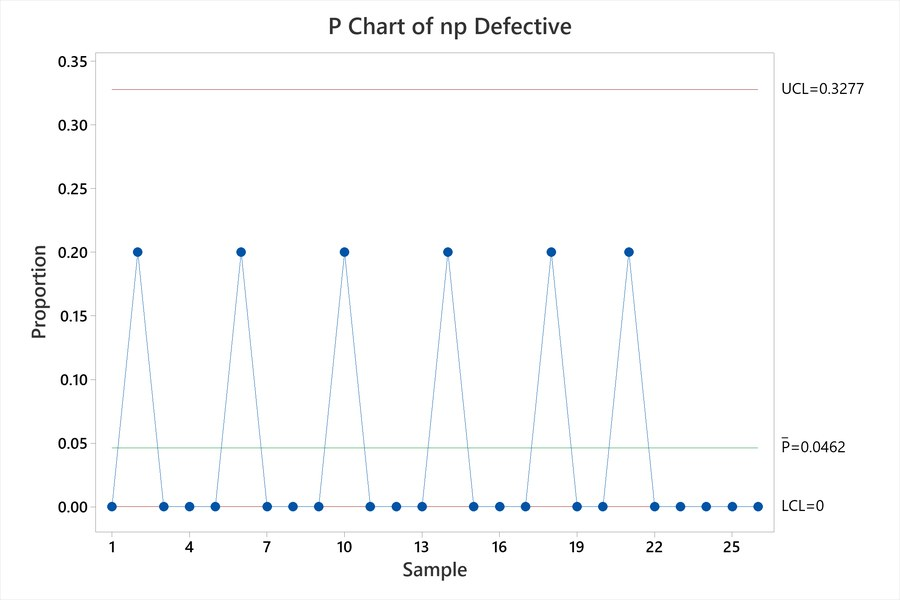

| Step | Tool | Purpose |
|---|---|---|
| 1 | X-bar & R Charts | Monitor process mean and variation |
| 2 | P-Chart | Track proportion of defective units |
| 3 | Fishbone Diagram (6M) | Identify root causes of variation |
| 4 | Pareto Chart | Rank causes — vital few vs. trivial many |
| 5 | Process Improvement | Apply corrective actions |
| 6 | Revised Control Charts | Verify stability after improvements |
| 7 | Anderson-Darling Normality Test | Validate normality assumption for Cpk |
| 8 | Process Capability (Cpk) | Assess whether process meets spec limits |
| 9 | Run Chart | Visualize trends over time |

---

## Step 1 — X-bar and R Charts (Initial)

### Manual Control Charts

| X-bar Chart | R Chart |
|:---:|:---:|
| 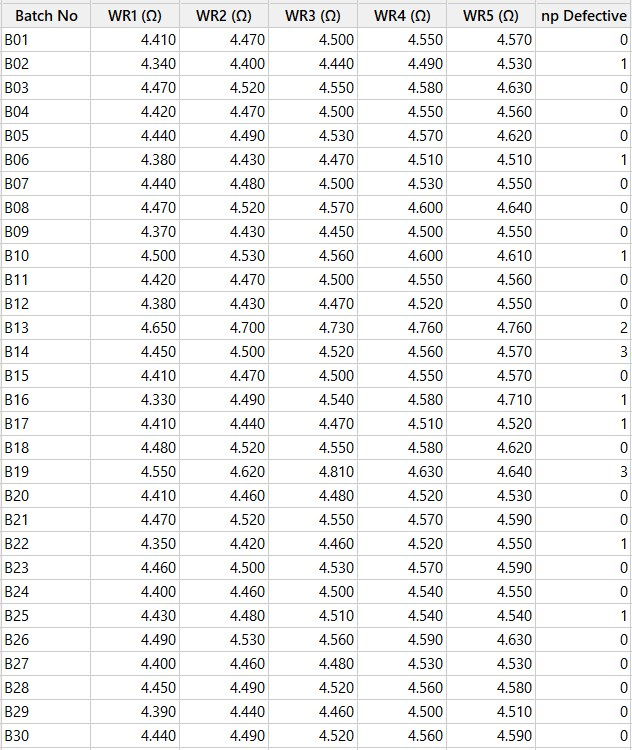 | 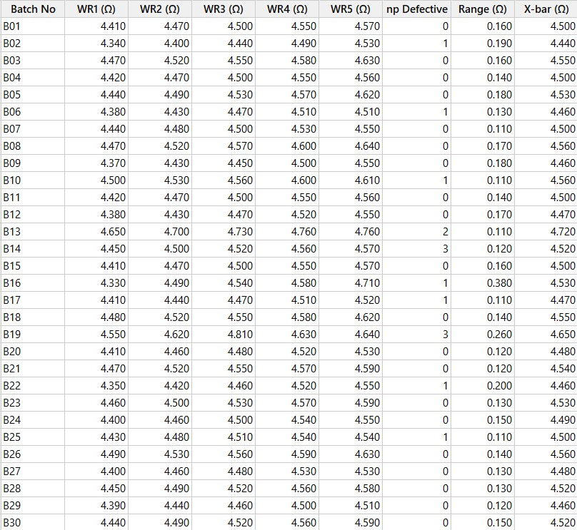 |
| **B13** (X̄=4.720) and **B19** (X̄=4.650) exceed UCL=4.606 → process mean shifted | **B16** (R=0.380) exceeds UCL=0.326 → abnormal within-batch spread |

### Minitab Control Charts

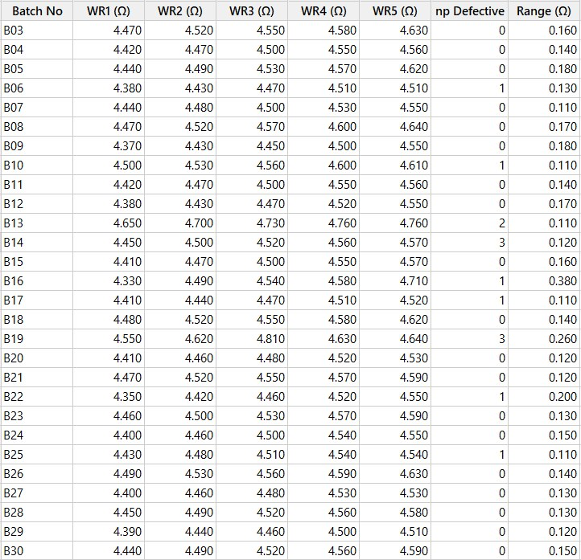

**Interpretation:** The process is **NOT in statistical control**. Out-of-control points detected:
- **R Chart:** B16 — abnormal variability (special cause)
- **X-bar Chart:** B13 and B19 — process mean shifted upward

---

## Step 2 — P-Chart (Proportion Defective)

| Manual P-Chart | Minitab P-Chart |
|:---:|:---:|
| 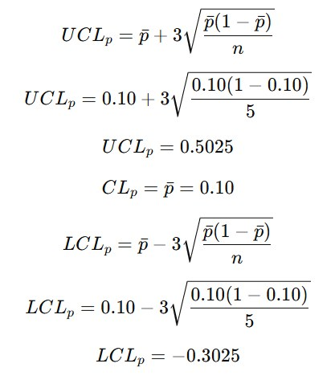 | 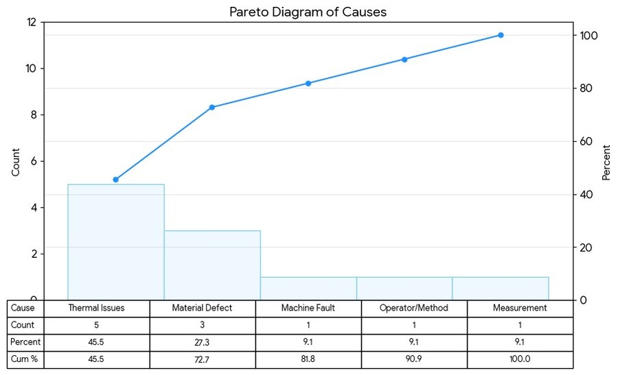 |
| Batches B14 and B19 exceed UCL (p=0.60) | Confirmed by Minitab — high defect rate in B14 & B19 |

**p̄ = 0.10** (10% average defect rate) · UCL = 0.5025 · LCL = 0

The p-chart confirms that the instability in the X-bar/R charts directly increases defect rates.

---

## Step 3 — Root Cause Analysis (Fishbone Diagram)

Investigation focused on out-of-control batches **B13, B14, B16, and B19** across 6 categories:

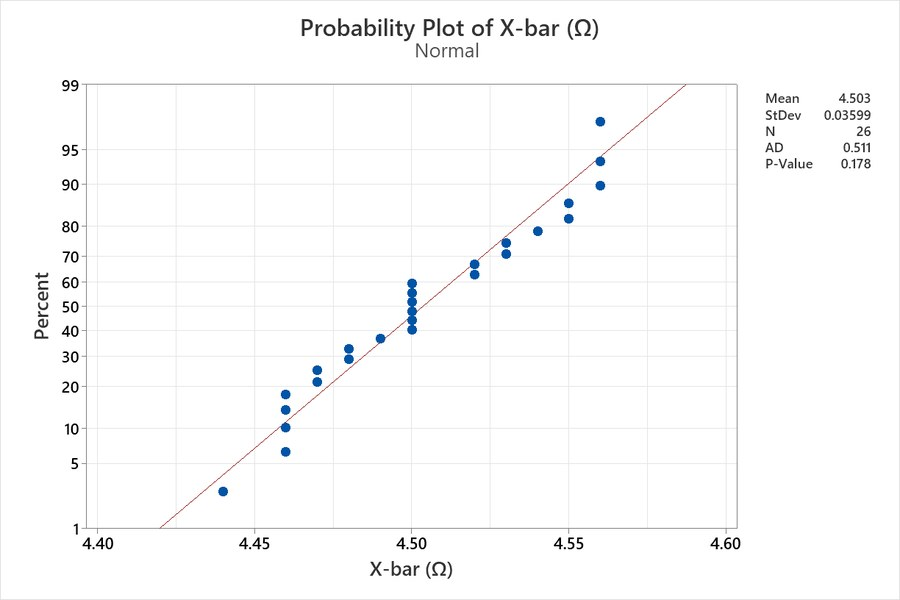

| Category | Key Causes Identified |
|---|---|
| **Machine** | Cooling system failure, bearing wear, no preventive maintenance |
| **Material** | Wire resistance variation, insulation coating defects, supply inconsistency |
| **Environment** | High ambient temperature, poor ventilation, no temperature monitoring |
| **Man / Method** | Operator fatigue, inadequate training, no escalation protocol |
| **Measurement** | No inline WR sensor, uncalibrated equipment, manual recording errors |
| **Mother Nature** | Humidity variation, seasonal temperature peaks |

---

## Step 4 — Pareto Analysis

| Manual Pareto Chart | Minitab Pareto Chart |
|:---:|:---:|
| 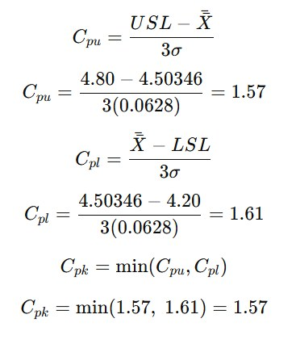 |  |

| Cause | Frequency | Cumulative % |
|---|---|---|
| **Thermal Issues** | 45.5% | 45.5% |
| **Material Defect** | 27.3% | 72.7% |
| Machine Fault | 9.1% | 81.8% |
| Operator/Method | 9.1% | 90.9% |
| Measurement | 9.1% | 100.0% |

**Thermal Issues + Material Defects = 72.7% of all defects → primary improvement targets.**

---

## Step 5 — Corrective Actions

Based on the Fishbone and Pareto results, targeted improvements were implemented:

- **Thermal Control** — Improved cooling systems, enhanced ventilation, real-time temperature monitoring during production
- **Material QC** — Standardized insulation coating, rigorous raw material inspection, supplier quality verification
- **Equipment Maintenance** — Preventive maintenance schedules, worn-part replacement, instrument calibration
- **Operator Training** — SPC training programs, escalation procedures, reduced manual errors

---

## Step 6 — Revised Control Charts (After Improvement)

Batches with confirmed assignable causes (B13, B14, B16, B19) were removed and control limits were recalculated.

### Revised X-bar and R Charts (Manual → Minitab)

| Revised X-bar | Revised R Chart |
|:---:|:---:|
| 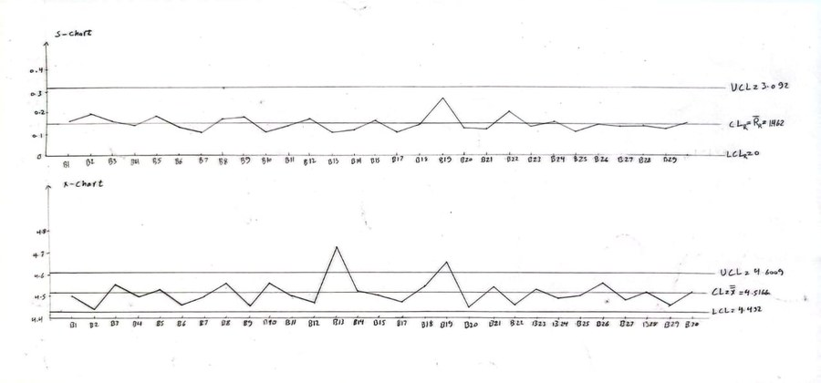 | 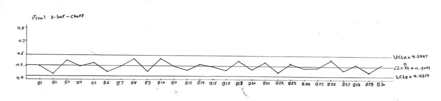 |

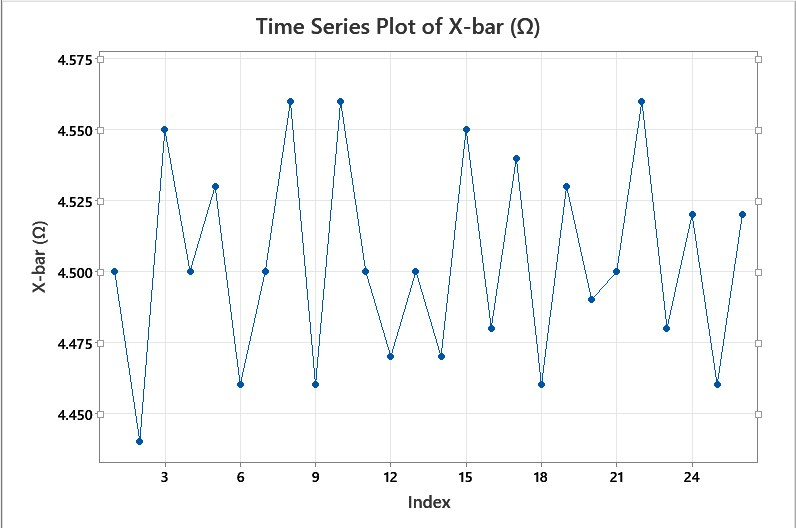

### Final X-bar Chart (After Removing B13, B16, B19)

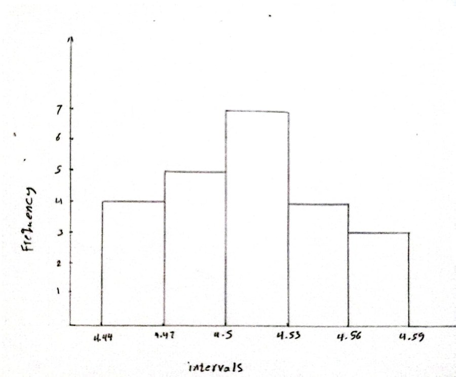

**All 27 remaining subgroup means now lie within control limits ✓**

### Revised P-Chart

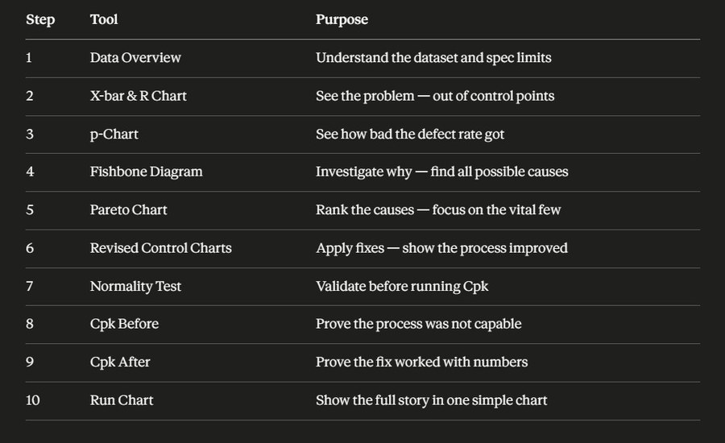

All defect proportions within limits after removing B13, B14, B16, B19. **Revised p̄ = 4.62%** (down from 10.0%).

---

## Step 7 — Normality Test

| Frequency Histogram | Anderson-Darling Test (Minitab) |
|:---:|:---:|
| 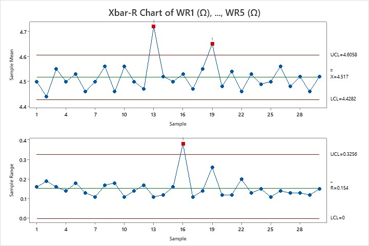 | 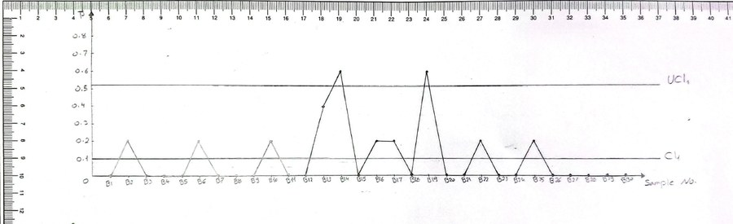 |
| Bell-shaped, approximately symmetric distribution | AD Statistic = 0.511 · **p-value = 0.178 > 0.05** |

**Result:** Normality assumption satisfied → Cpk analysis is valid ✓

---

## Step 8 — Process Capability Analysis (Cpk)

| Manual Cpk Calculation | Minitab Capability Report |
|:---:|:---:|
| 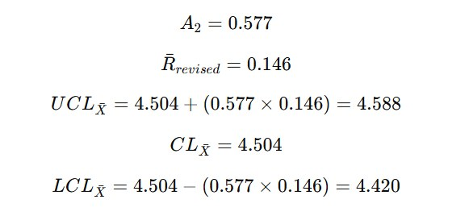 | 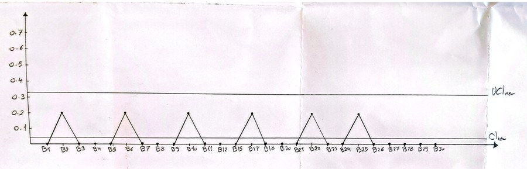 |

| Parameter | Value |
|---|---|
| LSL | 4.20 Ω |
| USL | 4.80 Ω |
| Final Process Mean | 4.503 Ω |
| σ = R̄ / d₂ | 0.0628 Ω |
| **Cpk (Manual)** | **1.57** |
| **Cpk (Minitab)** | **≈ 1.69** |

> Both values exceed 1.33 → **HIGHLY CAPABLE PROCESS** ✓  
> Process is well-centered within specification range.

---

## Step 9 — Run Chart

| Manual Run Chart | Minitab Run Chart |
|:---:|:---:|
| 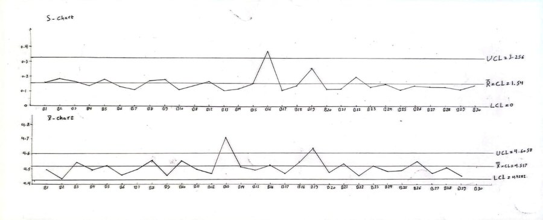 | 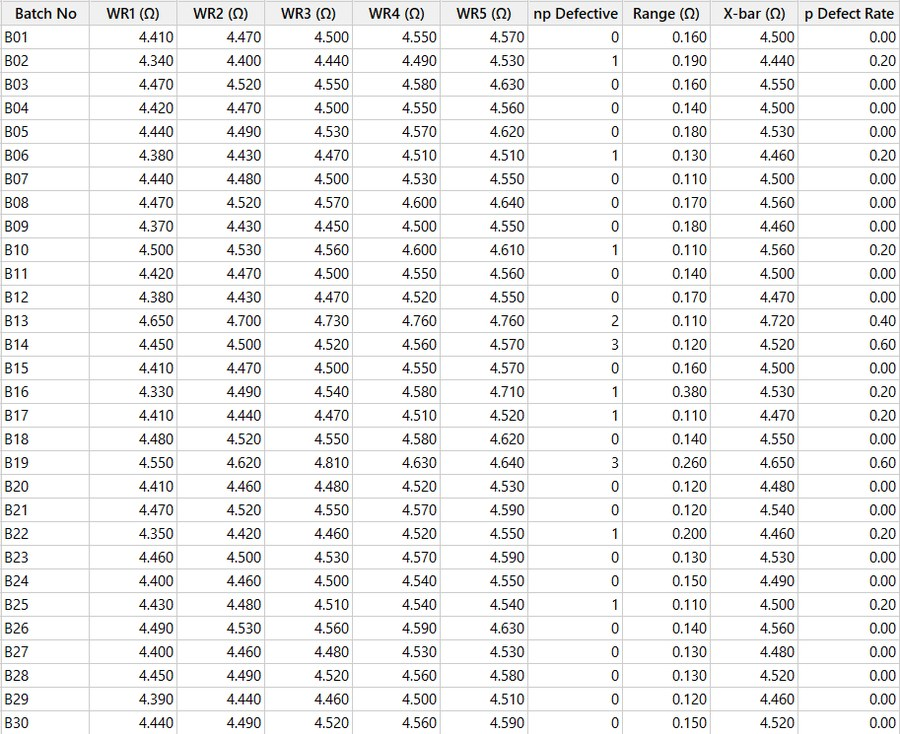 |

Subgroup means fluctuate randomly around the process mean — **no trends, shifts, or patterns** detected after corrective actions.

---

## Before vs. After Improvement

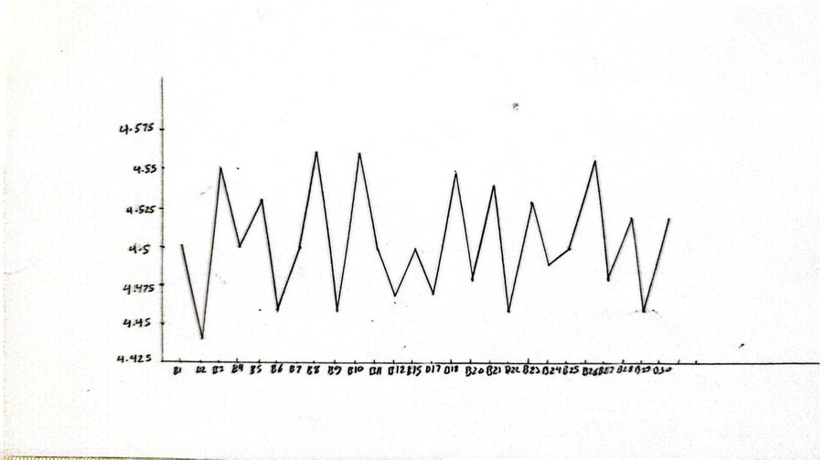

| Metric | Before Improvement | After Improvement |
|---|---|---|
| R Chart | **B16 out of control** (R = 0.380 > UCL) | All points within limits ✓ |
| X-bar Chart | **B13 & B19 out of control** | All points within limits ✓ |
| P-Chart | **B14 & B19 out of control** (p = 0.60) | All points within limits ✓ |
| Average Defect Rate | **10.0%** | **4.62%** (−54%) ✓ |
| Statistical Control | NOT in control | FULLY in control ✓ |
| Process Capability (Cpk) | Not reliable | **1.57 – 1.69** ✓ |

---

## Repository Structure

```
dc-motor-quality-control-spc/
├── data/
│   └── DCMotor_QC_Dataset.xlsx     # Raw dataset: 30 batches, n=5, WR + defect counts
└── docs/
    ├── QC_Report.pdf               # Full report with all calculations and analysis
    ├── QC_Presentation.pdf         # Project presentation slides
    └── images/                     # All charts: X-bar/R, P-chart, Fishbone,
                                    # Pareto, capability, normality, run charts
```

---

## Tools Used

- **Minitab** — Control charts, normality test, Pareto chart, process capability
- **Manual Calculations** — All SPC formulas by hand using Appendix VI constants (A₂, D₃, D₄, d₂)
- **SPC Methods** — X-bar/R charts, P-chart, Fishbone (6M), Pareto, Anderson-Darling, Cpk, Run chart
