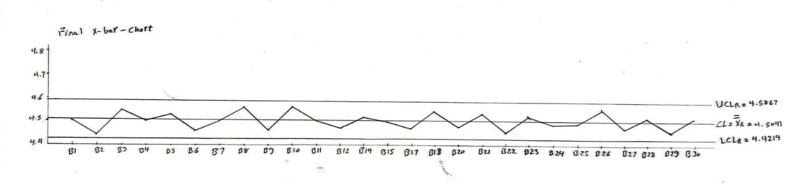
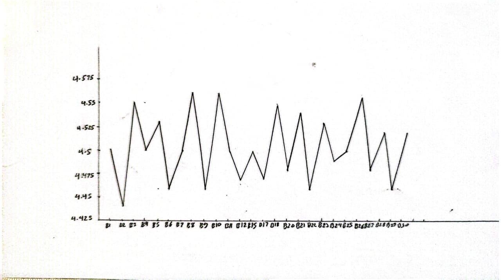

# DC Motor Manufacturing — Quality Control Using SPC

A full Statistical Process Control (SPC) study on a DC motor manufacturing process. The project takes **winding resistance (WR)** as the critical quality characteristic, diagnoses why the process is failing, identifies the root causes, applies targeted corrective actions, and then proves the process is now stable and highly capable — using both manual calculations and Minitab.

> **Course:** Quality Control  
> **Institution:** Helwan National University — Robotics & Mechatronics Engineering  
> **Supervisor:** Prof. Nariman &nbsp;|&nbsp; **TA:** Asmaa AL-Robi  
> **Team:** Yousef Ahmed Elbeltagy · Mohamad Sherif Shabrawy · Mohamed Ali Ismail · Verina Elkess · Yousef Wail Ismail · Amr Sherif Maher

---

## The Problem

A DC motor manufacturing line produces **DCM-750 motors**. For each motor, winding resistance must stay between **4.20 Ω (LSL)** and **4.80 Ω (USL)**. Resistance outside this range causes poor winding, overheating, or electrical defects.

**30 production batches** were analyzed, with **5 motors inspected per batch** (150 motors total). The goal: determine whether the process is stable, find what's causing failures, fix it, and prove the fix worked.

| Parameter | Value |
|---|---|
| Quality Characteristic | Winding Resistance (WR) in ohms (Ω) |
| Lower Spec Limit (LSL) | 4.20 Ω |
| Upper Spec Limit (USL) | 4.80 Ω |
| Batches Analyzed | 30 |
| Motors per Batch (n) | 5 |
| Total Motors Inspected | 150 |

---

## Phase 1 — Detecting the Problem

### X-bar and R Control Charts

The first step is to check whether the process mean (X-bar chart) and within-batch variation (R chart) are stable. Control limits are calculated from the data: UCL = 4.606 Ω, LCL = 4.428 Ω for the X-bar chart, and UCL = 0.326 for the R chart.


The Minitab chart immediately reveals the process is **out of statistical control**:

| Chart | Out-of-Control Batch | What It Means |
|---|---|---|
| **R Chart** | **B16** — range = 0.380 > UCL = 0.326 | Abnormal variation *within* that batch — something caused inconsistent resistance among the 5 motors |
| **X-bar Chart** | **B13** — mean = 4.720 Ω | Process mean shifted upward — all 5 motors in this batch wound too tightly |
| **X-bar Chart** | **B19** — mean = 4.650 Ω | Same pattern — another batch where the process mean drifted out of spec |

### P-Chart — Defect Rate Across All Batches

The p-chart checks what percentage of motors are defective in each batch (p̄ = 10%, UCL = 0.5025).


**B14 and B19** both spike to p = 0.60 — meaning **3 out of 5 motors** in each of those batches were defective. This directly confirms the instability seen in the X-bar chart: when the process mean shifts out of control, defect rates spike immediately.

**Summary:** The process is unstable. Batches B13, B14, B16, and B19 all show abnormal behavior. The question is — *why?*

---

## Phase 2 — Finding the Root Causes

### Fishbone (Ishikawa) Diagram

A cause-and-effect analysis was built targeting the four problem batches (B13, B14, B16, B19) across the 6M framework: Machine, Material, Measurement, Man/Method, Environment, Mother Nature.


| Category | Key Causes Identified |
|---|---|
| **Machine** | Cooling system failure, M2 bearing wear, no preventive maintenance schedule |
| **Environment** | High ambient temperature (38°C in B11–B13), inadequate ventilation, no thermal barriers |
| **Material** | Wire resistance variation, insulation coat QC failures, supply chain delays causing material substitution |
| **Measurement** | No inline WR sensor, uncalibrated equipment, manual data recording errors |
| **Man / Method** | Shift handover gaps, no escalation protocol, operator fatigue, inadequate training |
| **Mother Nature** | Humidity variation, seasonal temperature peaks coinciding with B13 and B19 |

### Pareto Chart — Prioritizing the Causes

The Pareto chart ranks all causes by frequency to identify the **vital few** that drive most of the defects.


| Cause | Frequency | Cumulative % |
|---|---|---|
| **Thermal Issues** | 45.5% | 45.5% |
| **Material Defect** | 27.3% | **72.7%** |
| Machine Fault | 9.1% | 81.8% |
| Operator/Method | 9.1% | 90.9% |
| Measurement | 9.1% | 100.0% |

> **Thermal Issues + Material Defects together account for 72.7% of all defects.** These two causes are the targets for corrective action.

---

## Phase 3 — Fixing the Process

Based on the Fishbone and Pareto analysis, the following corrective actions were implemented:

**Thermal Control**
- Improved cooling systems installed on the winding machines
- Workshop ventilation enhanced to maintain stable ambient temperature
- Real-time temperature monitoring added to the production line

**Material Quality**
- Insulation coating process standardized and documented
- Raw material incoming inspection tightened
- Supplier quality verification introduced to eliminate batch-to-batch variation

**Equipment & Maintenance**
- Preventive maintenance schedule established for all winding machines
- Worn M2 bearings identified and replaced
- All measurement instruments calibrated

**Process & People**
- SPC training provided to operators — escalation procedures defined
- Shift handover documentation improved to prevent communication gaps

---

## Phase 4 — Proving the Fix Worked

### Final X-bar Chart — Process Mean Fully Stable

After removing B16, B13, and B19 (confirmed assignable causes) and applying corrective actions, the X-bar chart was redrawn with new control limits (UCL = 4.599 Ω, LCL = 4.421 Ω).



**All 27 remaining batches lie within the control limits** — no trends, no shifts, no out-of-control points. The process mean is stable at X̄ = 4.504 Ω, well-centered within the specification range.

### Revised P-Chart — Defect Rate Dropped

After removing batches B13, B14, B16, and B19, the defect rate was recalculated and a new p-chart was built.


| Metric | Before Improvement | After Improvement |
|---|---|---|
| Average Defect Rate (p̄) | 10.0% | **4.62%** |
| UCL | 0.5025 | 0.3277 |
| Out-of-Control Batches | B14, B19 | **None** |

All 26 remaining batches are within the new control limits. Defect rate dropped by **54%**.

---

## Phase 5 — Validating Process Capability

### Normality Test (Anderson-Darling)

Before running Cpk, normality of the data must be confirmed. The Minitab probability plot shows data points closely following the normal reference line.


| Test | Result |
|---|---|
| Anderson-Darling Statistic | 0.511 |
| **p-value** | **0.178 > 0.05** |
| Conclusion | **Data is normally distributed — Cpk analysis is valid ✓** |

### Process Capability Report (Cpk)

With a stable, normal process confirmed, the capability analysis determines whether the process can reliably produce motors within the 4.20–4.80 Ω specification range.


| Parameter | Value |
|---|---|
| LSL | 4.20 Ω |
| USL | 4.80 Ω |
| Process Mean | 4.503 Ω |
| Standard Deviation (σ) | 0.0628 Ω |
| **Cpk (Manual Calculation)** | **1.57** |
| **Cpk (Minitab)** | **1.69** |

> Both values exceed the 1.33 benchmark → **HIGHLY CAPABLE PROCESS ✓**  
> The process is well-centered in the spec range with minimal variation. Expected defect rate: essentially zero (PPM ≈ 0.32).

### Run Chart — Stable Over Time

The run chart confirms the process shows no upward or downward trends, no prolonged shifts, and no cyclic patterns — random fluctuation only.



The run chart is consistent with the final X-bar chart — the process is stable, not just at a single point in time, but **across all 27 batches chronologically**.

---

## Results Summary — Before vs. After

| Metric | Before Improvement | After Improvement |
|---|---|---|
| R Chart | **B16 out of control** (abnormal variation) | All points within limits ✓ |
| X-bar Chart | **B13 & B19 out of control** (mean shifted) | All 27 batches within limits ✓ |
| P-Chart | **B14 & B19** — defect rate = 60% | All batches within limits ✓ |
| Average Defect Rate | **10.0%** | **4.62%** (−54%) ✓ |
| Statistical Control | NOT in control | FULLY in control ✓ |
| Normality | — | Confirmed (p = 0.178) ✓ |
| Process Capability Cpk | Not reliable | **1.57 – 1.69 (Highly Capable)** ✓ |

---

## Tools & Methods

| Tool | Used For |
|---|---|
| **Minitab** | X-bar/R charts, P-chart, Pareto, normality test, capability report, run chart |
| **Manual Calculations** | All control limits derived by hand using Appendix VI constants (A₂=0.577, D₃=0, D₄=2.114, d₂=2.326) |
| **SPC Methods** | X-bar/R, P-chart, Fishbone (6M), Pareto, Anderson-Darling, Cpk, Run chart |

---

## Repository Structure

```
dc-motor-quality-control-spc/
├── data/
│   └── DCMotor_QC_Dataset.xlsx      # Raw data: 30 batches × 5 motors, WR measurements + defect counts
└── docs/
    ├── QC_Report.pdf                # Full report with all manual calculations and Minitab output
    └── images/
        ├── minitab_xbar_r_initial.png    # Initial Xbar-R — B13, B16, B19 out of control
        ├── minitab_p_chart_initial.png   # Initial P-chart — B14, B19 exceed UCL
        ├── fishbone_diagram.png          # Root cause analysis (6M Ishikawa)
        ├── minitab_pareto.jpeg           # Pareto — thermal 45.5%, material 27.3%
        ├── final_xbar_minitab.jpeg       # Final Xbar — all 27 batches in control
        ├── revised_p_chart_minitab.png   # Revised P-chart — defect rate 4.62%
        ├── normality_ad_test.png         # Anderson-Darling — p=0.178, normality confirmed
        ├── capability_report.png         # Minitab Cpk report — Cpk=1.69
        └── run_chart_minitab.jpeg        # Run chart — no trends or patterns
```
