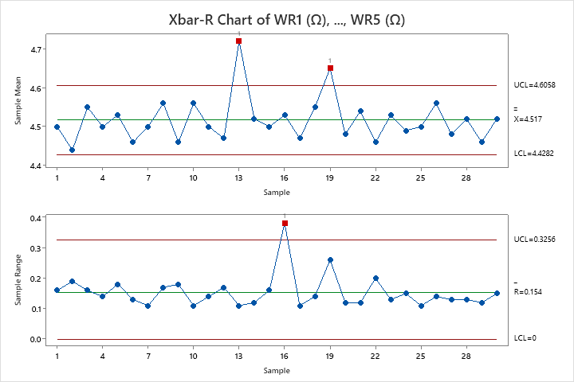
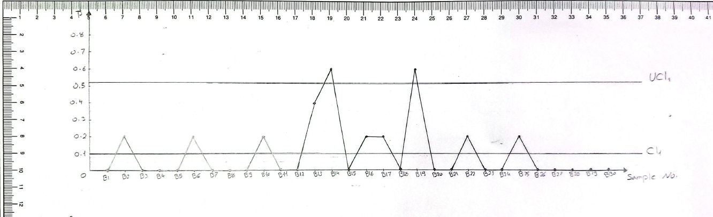
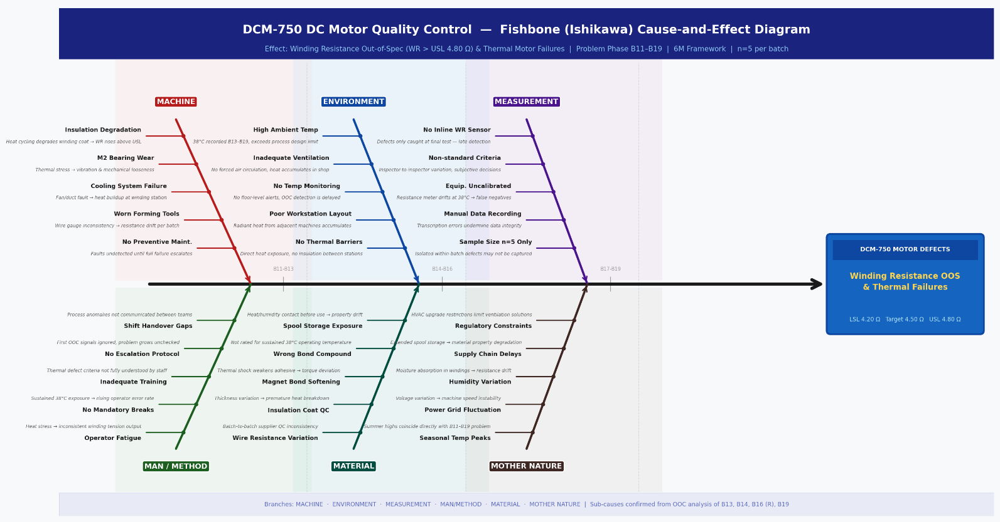
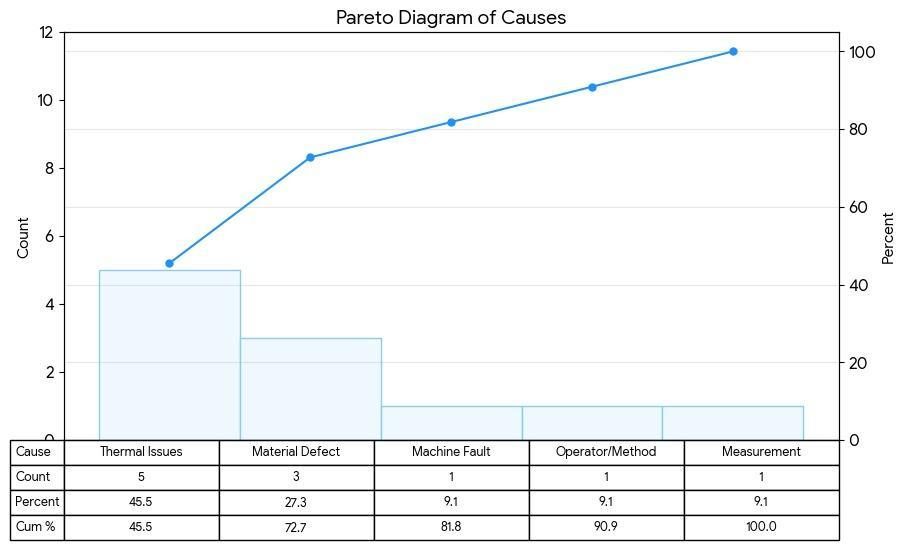
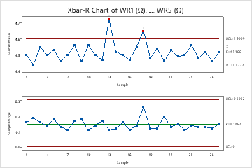
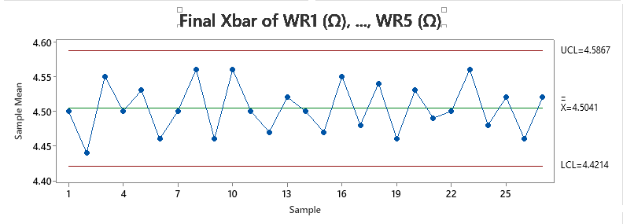
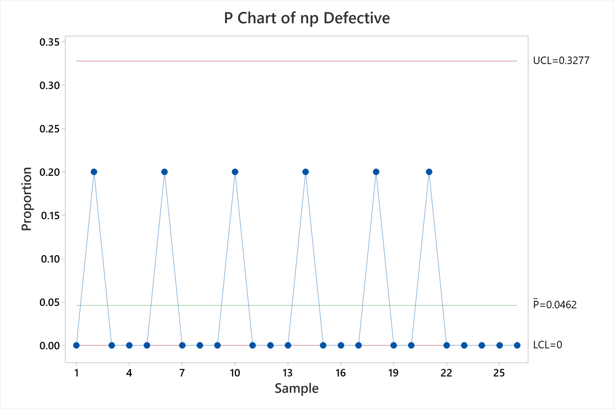
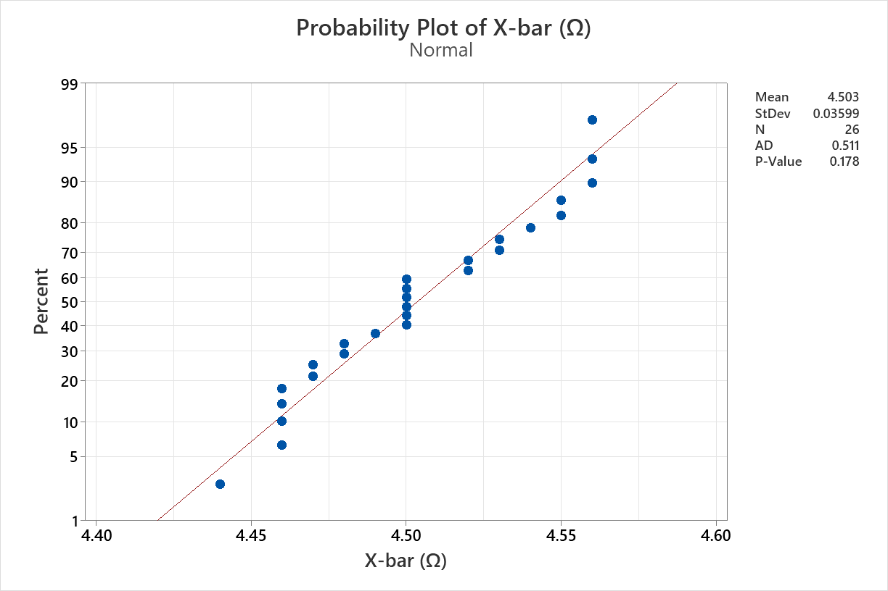
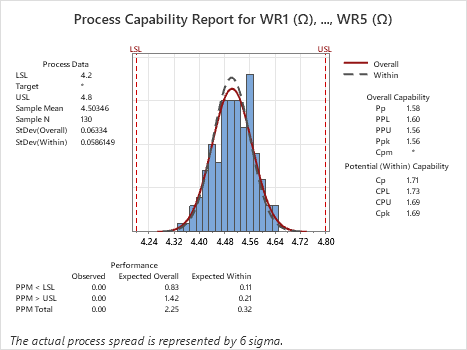
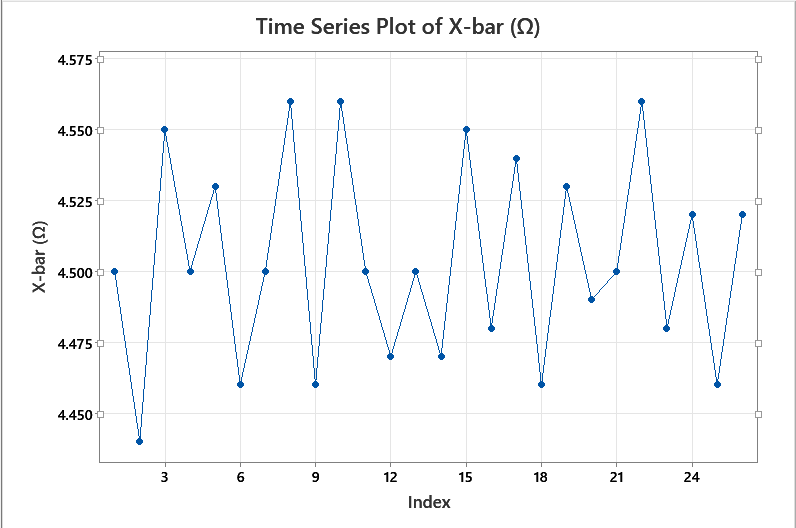

# DC Motor Manufacturing — Quality Control Using SPC

A full Statistical Process Control (SPC) study on a DC motor manufacturing process. The project takes **winding resistance (WR)** as the critical quality characteristic, diagnoses why the process is failing, identifies the root causes, applies targeted corrective actions, and then proves the process is now stable and highly capable — using both manual calculations and Minitab.

> **Course:** Quality Control  
> **Institution:** Helwan National University — Robotics & Mechatronics Engineering  
> **Supervisor:** Prof. Nariman &nbsp;|&nbsp; **TA:** Asmaa AL-Robi  
> **Team:** Yousef Ahmed Elbeltagy · Mohamad Sherif Shabrawy · Mohamed Ali Ismail · Verina Elkess · Yousef Wail Ismail · Amr Sherif Maher

---

## The Problem

A DC motor manufacturing line produces **DCM-750 motors**. For each motor, winding resistance must stay between **4.20 Ω (LSL)** and **4.80 Ω (USL)**. Resistance outside this range causes poor winding, overheating, or electrical defects.

**30 production batches** were analyzed, with **5 motors inspected per batch** (150 motors total). The goal: determine whether the process is stable, find what's causing failures, fix it, and prove the fix worked.

| Parameter | Value |
|---|---|
| Quality Characteristic | Winding Resistance (WR) in ohms (Ω) |
| Lower Spec Limit (LSL) | 4.20 Ω |
| Upper Spec Limit (USL) | 4.80 Ω |
| Batches Analyzed | 30 |
| Motors per Batch (n) | 5 |
| Total Motors Inspected | 150 |

---

## Phase 1 — Detecting the Problem

### X-bar and R Control Charts

The first step is to check whether the process mean (X-bar chart) and within-batch variation (R chart) are stable. Control limits: UCL = 4.606 Ω, LCL = 4.428 Ω for the X-bar chart, and UCL = 0.326 for the R chart.



The Minitab chart immediately reveals the process is **out of statistical control**:

| Chart | Out-of-Control Batch | What It Means |
|---|---|---|
| **R Chart** | **B16** — range = 0.380 > UCL = 0.326 | Abnormal variation *within* that batch — inconsistent resistance among the 5 motors |
| **X-bar Chart** | **B13** — mean = 4.720 Ω | Process mean shifted upward — all 5 motors in this batch wound too tightly |
| **X-bar Chart** | **B19** — mean = 4.650 Ω | Same pattern — process mean drifted out of spec |

### P-Chart — Defect Rate Across All Batches

The p-chart checks what percentage of motors are defective in each batch (p-bar = 10%, UCL = 0.5025).



**B14 and B19** both spike to p = 0.60 — meaning **3 out of 5 motors** in each of those batches were defective. This directly confirms the instability seen in the X-bar chart.

**Summary:** The process is unstable. Batches B13, B14, B16, and B19 all show abnormal behavior. The question is — *why?*

---

## Phase 2 — Finding the Root Causes

### Fishbone (Ishikawa) Diagram

A cause-and-effect analysis was built targeting the four problem batches (B13, B14, B16, B19) across the 6M framework.



| Category | Key Causes Identified |
|---|---|
| **Machine** | Cooling system failure, M2 bearing wear, no preventive maintenance |
| **Environment** | High ambient temperature (38°C in B11–B13), inadequate ventilation, no thermal barriers |
| **Material** | Wire resistance variation, insulation coat QC failures, supply chain inconsistency |
| **Measurement** | No inline WR sensor, uncalibrated equipment, manual data recording errors |
| **Man / Method** | Shift handover gaps, no escalation protocol, operator fatigue, inadequate training |
| **Mother Nature** | Humidity variation, seasonal temperature peaks coinciding with B13 and B19 |

### Pareto Chart — Prioritizing the Causes

The Pareto chart ranks all causes by frequency to identify the **vital few** that drive most defects.



| Cause | Frequency | Cumulative % |
|---|---|---|
| **Thermal Issues** | 45.5% | 45.5% |
| **Material Defect** | 27.3% | **72.7%** |
| Machine Fault | 9.1% | 81.8% |
| Operator/Method | 9.1% | 90.9% |
| Measurement | 9.1% | 100.0% |

> **Thermal Issues + Material Defects = 72.7% of all defects.** These are the primary targets for corrective action.

---

## Phase 3 — Fixing the Process

Based on the Fishbone and Pareto analysis, the following corrective actions were implemented:

- **Thermal Control** — Improved cooling systems, enhanced ventilation, real-time temperature monitoring
- **Material Quality** — Standardized insulation coating, tightened incoming inspection, supplier verification
- **Equipment & Maintenance** — Preventive maintenance schedules, worn M2 bearing replacement, instrument calibration
- **Process & People** — SPC operator training, escalation procedures, improved shift handover documentation

---

## Phase 4 — Verifying the Fix

### Step 1 — Revised Control Charts (After Removing B16)

B16 was identified as the cause of excessive within-batch variation. After removing it, new control limits were calculated and both charts were redrawn.



**R Chart:** All remaining batches now lie within the revised UCL = 0.309 — **variation is stable** ✓  
**X-bar Chart:** B13 and B19 still exceed the control limits — the process mean still needs attention

This shows the improvement is **iterative**: fixing the variation (R chart) was step one.

### Step 2 — Final X-bar Chart (After Removing B13, B16, and B19)

After applying additional corrective actions targeting the thermal and material root causes, B13 and B19 were also removed. The X-bar chart was redrawn with final limits (UCL = 4.599 Ω, LCL = 4.421 Ω).



**All 27 remaining batches lie within the control limits.** The process mean is stable at X-bar = 4.504 Ω, well-centered within the specification range.

### Step 3 — Revised P-Chart (Defect Rate After Improvement)

After removing batches B13, B14, B16, and B19, the defect rate was recalculated.



| Metric | Before | After |
|---|---|---|
| Average Defect Rate | 10.0% | **4.62%** |
| UCL | 0.5025 | 0.3277 |
| Out-of-Control Batches | B14, B19 | **None** |

Defect rate dropped by **54%**. All 26 remaining batches are within limits.

---

## Phase 5 — Validating Process Capability

### Normality Test (Anderson-Darling)

Before running Cpk, normality must be confirmed. The Minitab probability plot shows data points closely following the normal reference line.



| Test | Result |
|---|---|
| Anderson-Darling Statistic | 0.511 |
| **p-value** | **0.178 > 0.05** |
| Conclusion | **Data is normally distributed — Cpk analysis is valid** |

### Process Capability Report (Cpk)

The capability analysis determines whether the improved process reliably produces motors within the 4.20–4.80 Ω specification range.



| Parameter | Value |
|---|---|
| LSL | 4.20 Ω |
| USL | 4.80 Ω |
| Process Mean | 4.503 Ω |
| Standard Deviation | 0.0628 Ω |
| **Cpk (Manual)** | **1.57** |
| **Cpk (Minitab)** | **1.69** |

> Both values exceed 1.33 → **HIGHLY CAPABLE PROCESS** — expected defect rate near zero (PPM ≈ 0.32)

### Run Chart — Stable Over Time

The run chart confirms no trends, no shifts, and no cyclic patterns — random fluctuation only.



The process is stable not just at a single point in time, but **across all 27 batches chronologically**.

---

## Results Summary — Before vs. After

| Metric | Before | After |
|---|---|---|
| R Chart | **B16 out of control** (excessive variation) | All points within limits ✓ |
| X-bar Chart | **B13 & B19 out of control** (mean shifted) | All 27 batches within limits ✓ |
| P-Chart | **B14 & B19** at p = 0.60 (60% defective) | All batches within limits ✓ |
| Average Defect Rate | **10.0%** | **4.62%** (−54%) ✓ |
| Statistical Control | NOT in control | FULLY in control ✓ |
| Normality | — | Confirmed (p = 0.178) ✓ |
| Process Capability Cpk | Not reliable | **1.57 – 1.69 (Highly Capable)** ✓ |

---

## Tools & Methods

| Tool | Used For |
|---|---|
| **Minitab** | X-bar/R charts, P-chart, Pareto, normality test, capability report, run chart |
| **Manual Calculations** | All control limits by hand using Appendix VI constants (A2=0.577, D3=0, D4=2.114, d2=2.326) |
| **SPC Methods** | X-bar/R, P-chart, Fishbone (6M), Pareto, Anderson-Darling, Cpk, Run chart |

---

## Repository Structure

```
dc-motor-quality-control-spc/
├── data/
│   └── DCMotor_QC_Dataset.xlsx
└── docs/
    ├── QC_Report.pdf
    └── images/
        ├── minitab_xbar_r_initial.png      # Initial Xbar-R — B13, B16, B19 out of control
        ├── minitab_p_chart_initial.png     # Initial P-chart — B14, B19 exceed UCL
        ├── fishbone_diagram.png            # Root cause analysis (6M Ishikawa)
        ├── minitab_pareto.jpeg             # Pareto — thermal 45.5%, material 27.3%
        ├── revised_xbar_r_minitab.png      # Revised charts — R stable, X-bar still has B13/B19
        ├── final_xbar_minitab.png          # Final Xbar — all 27 batches in control
        ├── revised_p_chart_minitab.png     # Revised P-chart — defect rate 4.62%
        ├── normality_ad_test.png           # Anderson-Darling — p=0.178 confirmed
        ├── capability_report.png           # Minitab Cpk = 1.69
        └── run_chart_minitab.png           # Run chart — no trends or patterns
```
